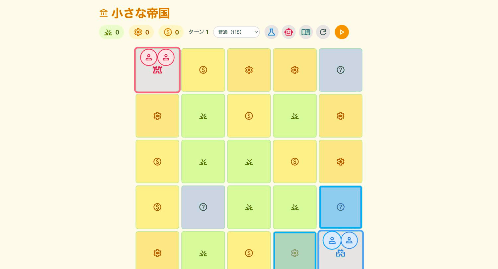
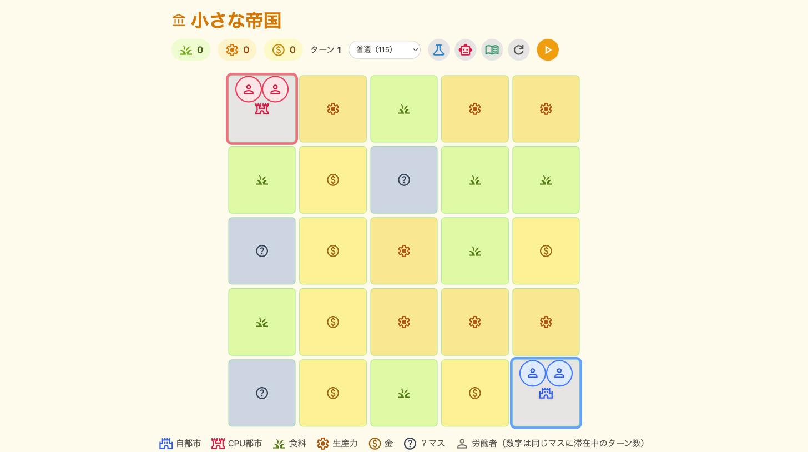
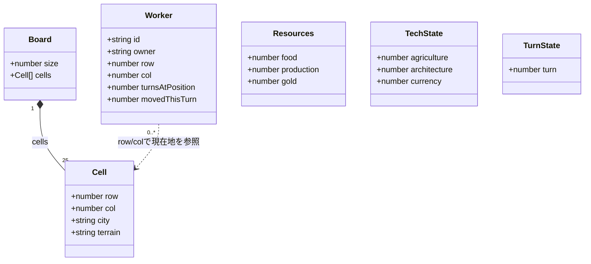
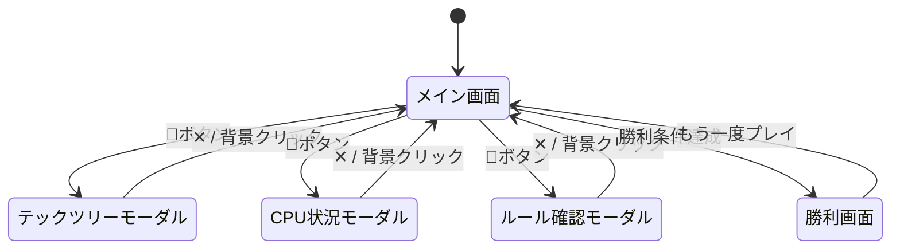
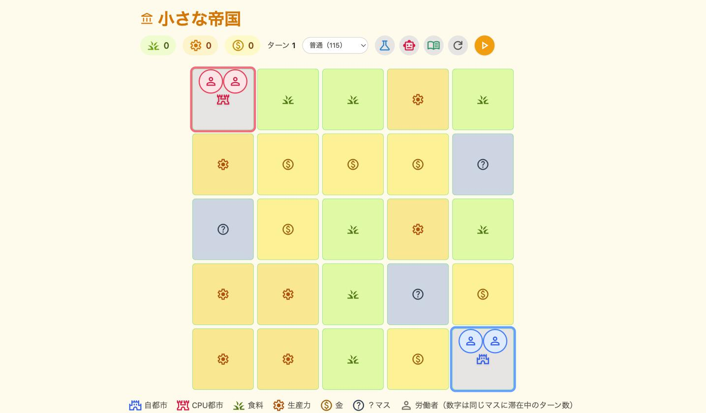
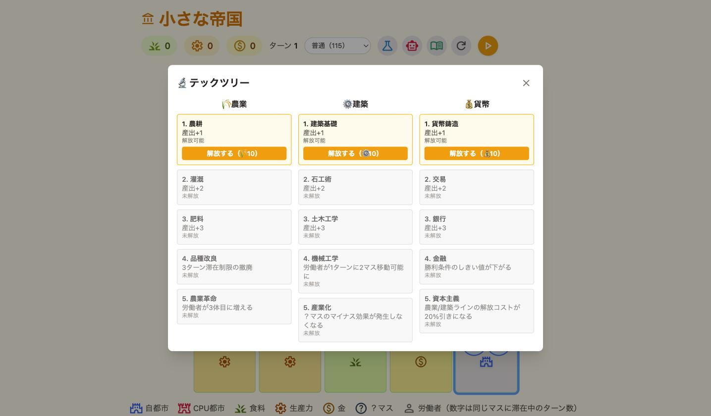
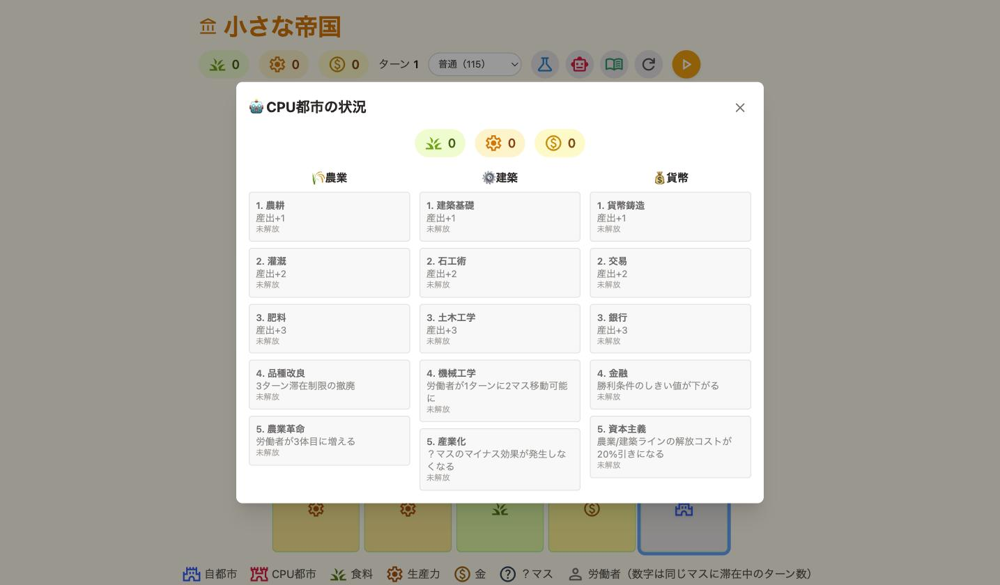
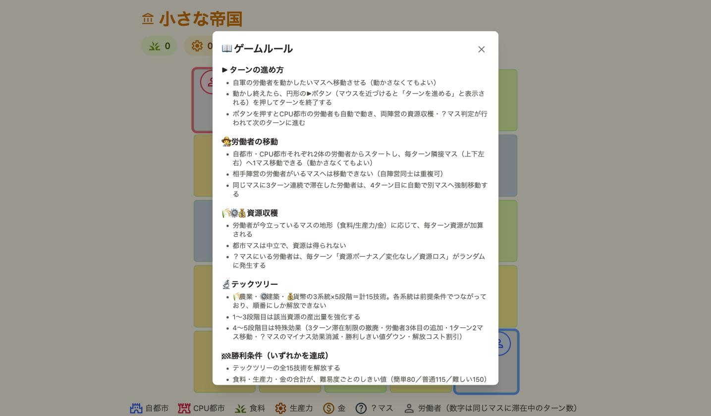
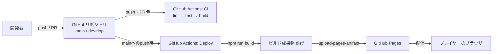

# 小さな帝国

限られた資源をどう配置し、どの技術を選ぶか——超ミニ4X（シヴィライゼーション風ターン制ゲーム）

> リポジトリ名は`micro-empire`ですが、ゲームタイトルは「小さな帝国」です。

- サービスURL：https://satou20250828.github.io/micro-empire/
- Qiita記事：（投稿後に記載）

## 🚀 サービス概要

- **コンセプト：** 1年前に初めて作ったプログラム（テキスト版五目並べ）と今の自分を比較するために作った、超ミニ4X（シヴィライゼーション風）の経済シミュレーションゲーム
- **プレイ体験：** 5×5マスの盤面で、自都市とCPU都市がそれぞれ2体の労働者を動かし、食料・生産力・金の3資源を稼ぎ合うブラウザ完結ゲーム。戦闘要素はなく、CPUは同じ盤面で資源を稼ぎ合う競争相手という位置づけ。3系統×5段階・計15技術のテックツリーをすべて解放するか、資源合計が難易度別のしきい値に到達すると勝利になります
- **技術の見どころ：** フレームワークを使わないVanilla JSでの状態管理設計／Git Flow・Issue駆動開発によるプロセスの仕組み化／GitHub ActionsによるCI（lint・test）自動化



## 📋 目次

- [🎯 コンセプト・開発背景](#-コンセプト開発背景)
- [📝 機能一覧](#-機能一覧)
- [✨ こだわり・工夫・苦労した点](#-こだわり工夫苦労した点)
- [🛠 使用技術・選定理由](#-使用技術選定理由)
- [🤝 AIとの協働について](#-AIとの協働について)
- [⚙️ 開発環境・構築手順](#️-開発環境構築手順)
- [📊 設計資料](#-設計資料)
- [🏗️ インフラ構成図](#️-インフラ構成図)
- [🚀 今後の展望](#-今後の展望)

## 🎯 コンセプト・開発背景

### **1年前の自分と、今の自分を比べるために**

#### 開発の原体験
プログラミングを始めたきっかけは、大塚あみさんの「#100日チャレンジ」という記事を読んだことでした。当時、最初に自分の手で作り上げたプログラムは、テキスト版の五目並べでした。

それから約1年が経ち、今の自分がどれくらい成長できているのかを、自分自身で確かめられる作品を作りたいと考えました。ただ動くものを作るのではなく、**1年前には作れなかった規模・複雑さのアプリに挑戦すること**を、このプロジェクトの出発点にしています。

#### 1年前 → 今

<table>
<tr>
<td width="50%" valign="top" align="center">

**1年前：はじめて自分で作ったプログラム**
[kantanbangomoku](https://github.com/Satou20250828/MyCreations/tree/main/kantanbangomoku)（Python製・テキスト版五目並べ）

```
    0  1  2  3  4  5  6  7  8  9 
  +------------------------------+
 0| -  -  -  -  -  -  -  -  -  -  |
 1| -  -  -  -  -  -  -  -  -  -  |
 2| -  -  -  -  -  -  -  -  -  -  |
 3| -  -  -  -  -  -  -  -  -  -  |
 4| -  -  -  -  -  -  -  -  -  -  |
 5| -  -  -  -  -  X  -  -  -  -  |
 6| -  -  -  -  -  -  -  -  -  -  |
 7| -  -  -  -  -  -  O  -  -  -  |
 8| -  -  -  -  -  -  -  -  -  -  |
 9| -  -  -  -  -  -  -  -  -  -  |
  +------------------------------+
あなたの番です。座標を入力してください
> 
```

</td>
<td width="50%" valign="top" align="center">

**今：「小さな帝国」**



</td>
</tr>
</table>

#### なぜこのテーマなのか
題材に選んだのは、以前から思い入れのあるCivilizationです。限られた資源をどう使うか、どの技術を選ぶかなど、自分で考えて戦略を組み立てていくところに面白さを感じていました。

五目並べが「1つのルールで完結するシンプルなゲーム」だったのに対し、Civilization風のゲームは盤面・資源・テックツリー・勝敗判定など、**複数の要素が互いに影響し合う状態管理**が要求されます。この「連動する仕組み」を自分の手で設計・実装できるかどうかが、1年前の自分と今の自分を隔てる一番わかりやすい物差しになると考え、このテーマに決めました。

## 📝 機能一覧

### **1. コアゲームプレイ**
- **5×5マスの盤面**
  自都市🏰とCPU都市🏯を対角に配置。23マスに食料・生産力・金の地形をランダムに割り当て、3マスは結果が読めない「？マス」として伏せています。
- **労働者移動**
  自都市・CPU都市それぞれ2体の労働者を、毎ターン隣接マスへ1マス移動できます。同じマスに3ターン連続で滞在すると、4ターン目には強制的に別マスへ移動します。
- **資源収穫**
  労働者が今立っているマスの地形に応じて、食料・生産力・金が毎ターン加算されます。？マスにいる労働者は、到達するたびに結果（ボーナス／変化なし／ロス）がランダムに変わります。

### **2. テックツリー・戦略要素**
- **3系統×5段階、計15技術**
  🌾農業／⚙️建築／💰貨幣の3系統。各系統は前提条件でつながった一直線で、1〜3段階目は産出量の強化、4段階目はゲームルールの制約解除、5段階目は系統ごとの強力な仕上げです。
- **CPU簡易AI**
  プレイヤーと同じ移動・滞在ルールに従いながら、資源マスを優先して自律的に行動します。
- **勝敗判定・難易度選択**
  全テック解放、または資源合計が難易度別のしきい値（簡単80／普通115／難しい150）に到達すると勝利になります。

### **3. UI・UX機能**
- **CPU状況パネル**
  CPU側の資源・テック解放状況を、閲覧専用のモーダルでいつでも確認できます。
- **ルール確認モーダル**
  ヘッダーのボタンから、ゲームルールをいつでもモーダルで見返せます。
- **リセット・難易度変更**
  盤面をいつでも初期状態からやり直せます。

## ✨ こだわり・工夫・苦労した点

### 苦労した点
・**フレームワークなしでの画面更新の仕組み**：状態が変わったときに画面をどう更新するか、自分で設計する必要があり、最初は方法に迷いました
・**ランダム性のあるロジックのテスト方法**：？マスの抽選効果のように乱数が絡む処理を、どうやって再現性のある形でテストするか悩みました
・**レイアウトの試行錯誤**：盤面サイズ・配色・要素の配置は一度で決まらず、フィードバックを受けて何度も作り直しました

### 工夫した点
・**`render()`関数への統一**：全体を1つの`render()`関数にまとめ、状態が変わるたびに呼び直すシンプルな設計にし、見通しの良いコードにしました
・**`Math.random`のモック化**：`vi.spyOn`で乱数を差し替えることで、ランダム性のある処理も再現性のある形でテストできるようにしました
・**既存ロジックの再利用**：CPU AI実装ではCPU専用のルールを増やさず、プレイヤーと共通のロジックをそのまま利用し、新規に書く範囲を最小限に絞りました
・**レビューしやすい粒度でのPR分割**：15技術の実装を1本のPRに詰め込まず、着手前に2つのIssueに分割しました
・**`clamp()`によるレスポンシブ対応**：メディアクエリを書かずに1行で、画面幅に応じた盤面サイズ調整を実現しました

### こだわった点
・**HTML要素での盤面描画**：CanvasではなくHTML要素（div）とTailwindで描画し、デザインの細かい調整をしやすくすることを優先しました
・**操作性の作り込み**：移動可能マスのハイライトや労働者コマのサイズを、直感的に操作できるよう調整しました
・**開発途中、未実装の機能も隠さない表示**：テックツリーの1〜3段階目を実装した時点（Issue #5）では4〜5段階目が未実装でしたが、機能の存在自体を隠さず「今後実装予定」と明記して表示することを選びました。現在は4〜5段階目もすべて実装済みで、この表記はUIから削除しています
・**ユーザー目線での使い勝手**：勝敗結果画面に「もう一度プレイ」ボタンを追加し、すぐ再挑戦できるようにしました

## 🛠 使用技術・選定理由

- **Vite + Vanilla JS**：Reactなどのフレームワークも検討しましたが、最終的にVanilla JSを選んだのは、GitHub Pagesでの公開・運用のしやすさを優先したかったからです。Webアプリケーションは今後も何本も作っていく予定のため、費用をかけずに、かつビルド設定に手間をかけずに気軽に公開・非公開を切り替えられることを重視しています。Reactでも静的サイトとしてGitHub Pagesに公開すること自体は可能ですが、ルーティングやビルド設定など気にする点が増えるため、素のJavaScriptをViteでビルドするだけで完結するVanilla JSの方が、シンプルにデプロイまで持っていけると判断しました。
- **Tailwind CSS v4**：CSS-first設定（`@theme`）。盤面の装飾表現にCSSが直接効く必要があったため、Canvasは不採用にしています。
- **Vitest**：Vite系のテストランナーで導入コストが低く、CIとの統合もしやすいため採用。
- **GitHub Actions**：PRごとにlint・testを自動実行するCIに加え、mainへのマージ時にGitHub Pagesへ自動デプロイ。
- **Git Flow + Issue駆動開発**：`main / develop / feature/* / release/* / hotfix/*` を省略せずに運用。全体方針Issueと機能ごとのセクションIssueに分けて開発しています。

## 🤝 AIとの協働について

本プロジェクトは、AnthropicのAIコーディングエージェント「Claude Code」を活用して開発しました。役割分担は以下のとおりです。

- **意思決定は自分で行う**：何を作るか・なぜ作るか、設計方針、AIが出した提案の採用可否といった判断はすべて自分で行っています
- **実装作業はAIに任せる**：コード生成・リファクタリング・テストコード作成・Issue/PR文面の作成などは、Claude Codeに任せています
- **判断が「丸投げ」にならないための工夫**：①AIが選択肢とメリット・デメリットを整理して提示する→②相談しながら判断基準を整理する→③自分が選択肢の中から選ぶ、という3ステップを踏むことで、実装をAIに任せつつも設計判断は自分の手元に残しています

各Issueには、AIとどのようなやり取りをして何を判断したかの記録が残っています（例：[Issue #1](https://github.com/Satou20250828/micro-empire/issues/1)）。

## ⚙️ 開発環境・構築手順

### 動作環境
- Node.js 20以上

### セットアップ手順

#### 1. リポジトリをクローン
```bash
git clone https://github.com/Satou20250828/micro-empire.git
cd micro-empire
```

#### 2. 依存パッケージをインストール
```bash
npm install
```

#### 3. 開発サーバーを起動
```bash
npm run dev
```
起動後、ターミナルに表示されるURL（通常 http://localhost:5173 ）にブラウザでアクセスすると動作を確認できます。

### その他のコマンド
```bash
npm run build    # 本番ビルド
npm run preview  # ビルド結果のプレビュー
npm run lint     # ESLintチェック
npm run format   # Prettier整形
npm run test     # Vitestによるユニットテスト
```

## 📊 設計資料

- 仕様・設計判断の変遷はGitHub Issue（[#1 プロジェクト全体方針・仕様](https://github.com/Satou20250828/micro-empire/issues/1)）のコメント欄に記録しています

### 状態構造図

本アプリはDB（永続化ストレージ）を持たない構成のため、ER図の代わりに、クライアント側で保持している主要な状態オブジェクトの構造を示します。すべてmain.js側の変数に集約し、他のモジュールはこれらを受け取って処理するだけのステートレスな関数として実装しています。



- `Board`：盤面の地形情報のみを保持し、労働者の位置情報は持たない
- `Worker`：自都市・CPU都市それぞれの労働者。`row`/`col`で現在地を表現し、盤面側とは疎結合
- `Resources`／`TechState`：自軍・CPUでそれぞれ別インスタンスを持つ

### 画面遷移図



各モーダルは排他的に開閉する仕組みになっており、いずれか1つを開くと他は自動的に閉じます。

### 画面一覧

<table>
<tr>
<td width="50%" valign="top" align="center">

**メイン画面**


</td>
<td width="50%" valign="top" align="center">

**テックツリーモーダル**


</td>
</tr>
<tr>
<td width="50%" valign="top" align="center">

**CPU都市の状況モーダル**


</td>
<td width="50%" valign="top" align="center">

**ルール確認モーダル**


</td>
</tr>
</table>

## 🏗️ インフラ構成図

GitHub Pages＋GitHub Actionsのみで完結する、無料枠内のシンプルな構成です。



- **CI**：`develop`／`main`への push・PR時に、lint・test・buildを自動実行（`.github/workflows/ci.yml`）
- **デプロイ**：`main`へのpush時にのみ、ビルドしてGitHub Pagesへ自動デプロイ（`.github/workflows/deploy.yml`）
- サーバーやDBを持たないため、インフラコストは常に0円

## 🚀 今後の展望

- **盤面タイルの六角形化**：現在は正方形マスの5×5グリッド。六角形タイルにすることで、隣接方向が4方向から6方向に増え、より戦略性のある盤面にできないか検討する
- **盤面サイズの拡張検討**：現在は5×5マス固定。労働者移動方式で遊んでみた結果を踏まえて、盤面を広げるかどうかを検討する
